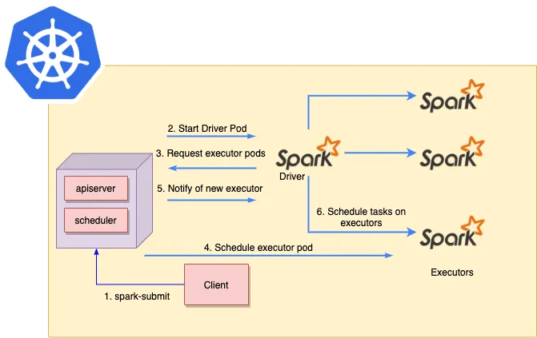

# Spark-on-Kubernetes
## Overview
Make running Spark on Kubernetes easy.

## Key Questions
- How to submit Spark jobs
- How to access Spark UI
- How to check Spark logs
- How to schedule batch jobs
- How to support Jupyter Notebook
- How to support Spark Streaming

## Architecture
- Spark Submit is sent from a client to the Kubernetes API server in the master node.
- Kubernetes will schedule a new Spark Driver pod.
- Spark Driver pod will communicate with Kubernetes to request Spark executor pods.
The new executor pods will be scheduled by Kubernetes.
- Once the new executor pods are running, Kubernetes will notify Spark Driver pod that new Spark executor pods are ready.
- Spark Driver pod will schedule tasks on the new Spark executor pods.

## Versions

| Kubernetes Version | Spark Version |
| ------------------ | ------------- |
|  *TODO*            |     *TODO*    |

## Setup
### Minikube
*TODO*

### GCP
*TODO*

## Reference
- [Running Apache Spark on Kubernetes](https://medium.com/empathyco/running-apache-spark-on-kubernetes-2e64c73d0bb2)