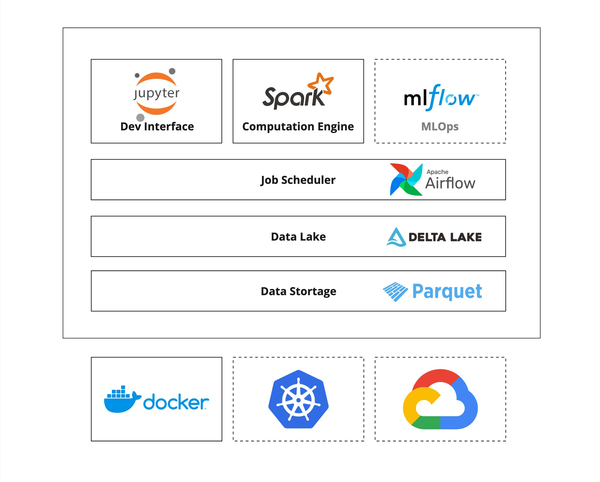

<h1 align="center">PawMark: Platform For Big Data & AI</h2>

[](https://github.com/xuwenyihust/DataPulse/releases)


[](https://github.com/xuwenyihust/Data-Platform/blob/main/LICENSE)


## Summary
PawMark is a platform for big data and AI. It is based on Apache Spark and Kubernetes. The platform is designed to be scalable and easy to use. It provides a set of tools for data processing, machine learning, and data visualization.

<p align="center">

</p>

## Quick Start

### Docker Compose
<details>
<summary>Details</summary>

- Start [docker-compose](./docker-compose.yml)

  ```bash
  docker-compose up -d
  ```
- Access platform UI
  - http://localhost:5001
- Use notebook
  - Access [http://localhost:8888](http://localhost:8888)
  - Spark session is automatically created
    - Run `spark` in cell to check the spark session
  - Run the following code in the notebook to test the spark session
    ```python
    spark.range(0, 5) \
      .write.format("delta").mode("overwrite").saveAsTable("test")
    ```
- Check the history server
  - Access [http://localhost:18080](http://localhost:18080)
  - Spark application history / progress can be viewed here

- Delta tables
  - Use `/opt/data/delta-table/` as the root directory for delta tables

- Schedule with Airflow
  - Access [http://localhost:8090](http://localhost:8090)
  - Use the default username and password to login
  - Create a new DAG to schedule the spark job
  - Or use the example DAGs in the [`./dags`](./dags/) folder
</details>

### MiniKube
- TODO

## Examples
### Basic Analysis on Static Tables 
- Singapore Resale Flat Prices Analysis
  - [Notebook](./examples/sg-resale-flat-prices/sg-resale-flat-prices-analysis.ipynb)
  - [Data Source](https://beta.data.gov.sg/datasets/d_8b84c4ee58e3cfc0ece0d773c8ca6abc/view)

### Incremental Pipeline
- TODO

## Docker Images
<details>
<summary>WebApp</summary>

[](https://github.com/xuwenyihust/DataPulse/actions/workflows/build-docker-webapp.yml)

- [Dockerfile](./webapp/Dockerfile) 

</details>

<details>
<summary>Spark</summary>

[](https://github.com/xuwenyihust/DataPulse/actions/workflows/build-docker-spark.yml)

- [Dockerfile](./docker/spark/Dockerfile) 
- Includes
  - Spark
  - Python

</details>

<details>
<summary>Notebook</summary>

[](https://github.com/xuwenyihust/DataPulse/actions/workflows/build-docker-notebook.yml)

- [Dockerfile](./docker/notebook/Dockerfile)
- Includes
  - Jupyter Notebook
  - Spark
  - Google Cloud SDK
  - GCS Connector
  - Pyspark Startup Script
  - Notebook Save Hook Function
</details>

<details>
<summary>History Server</summary>

[](https://github.com/xuwenyihust/DataPulse/actions/workflows/build-docker-history-server.yml)

- [Dockerfile](./docker/history-server/Dockerfile) 
- Includes
  - Spark
  - GCS Connector
</details>

<details>
<summary> Airflow </summary>

[](https://github.com/xuwenyihust/DataPulse/actions/workflows/build-docker-airflow.yml)

- [Dockerfile](./docker/airflow/Dockerfile) 
- Includes
  - Python
  - Java
  - pyspark
</details>


## Versions
| Component    | Version |
|--------------|---------|
| Scala        | 2.12    |
| Java         | 17      |
| Python       | 3.11    |
| Apache Spark | 3.5.0   |
| Delta Lake   | 3.0.0   |
| Airflow      | 2.9.1   |
| Postgres     | 13      |
| React        | 18.3.1  |


## License
This project is licensed under the terms of the MIT license.

## Reference
- [Running Apache Spark on Kubernetes](https://medium.com/empathyco/running-apache-spark-on-kubernetes-2e64c73d0bb2)
- [spark-docker](https://github.com/apache/spark-docker)